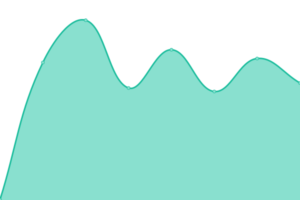

# [📈 Live Status](https://Dein-Ticket-Shop.github.io/status): <!--live status--> **🟩 All systems operational**

This repository contains the open-source uptime monitor and status page for [Dein-Ticket.Shop](https://dein-ticket.shop), powered by [Upptime](https://github.com/upptime/upptime).

With [Upptime](https://upptime.js.org), you can get your own unlimited and free uptime monitor and status page, powered entirely by a GitHub repository. We use [Issues](https://github.com/Dein-Ticket-Shop/status/issues) as incident reports, [Actions](https://github.com/Dein-Ticket-Shop/status/actions) as uptime monitors, and [Pages](https://Dein-Ticket-Shop.github.io/status) for the status page.

<!--start: status pages-->
<!-- This summary is generated by Upptime (https://github.com/upptime/upptime) -->
<!-- Do not edit this manually, your changes will be overwritten -->
<!-- prettier-ignore -->
| URL | Status | History | Response Time | Uptime |
| --- | ------ | ------- | ------------- | ------ |
|  [Dein-Ticket.Shop](https://dein-ticket.shop) | 🟩 Up | [dein-ticket-shop.yml](https://github.com/Dein-Ticket-Shop/status/commits/HEAD/history/dein-ticket-shop.yml) | 

 1035ms
     
 | 

<a href="https://status.dein-ticket.shop/history/dein-ticket-shop">100.00%</a>
    

|  Login | 🟩 Up | [login.yml](https://github.com/Dein-Ticket-Shop/status/commits/HEAD/history/login.yml) | 

 724ms
     
 | 

<a href="https://status.dein-ticket.shop/history/login">100.00%</a>
    

|  Online-Shop | 🟩 Up | [online-shop.yml](https://github.com/Dein-Ticket-Shop/status/commits/HEAD/history/online-shop.yml) | 

 917ms
     
 | 

<a href="https://status.dein-ticket.shop/history/online-shop">100.00%</a>
    

|  Admin-Bereich | 🟩 Up | [admin-bereich.yml](https://github.com/Dein-Ticket-Shop/status/commits/HEAD/history/admin-bereich.yml) | 

 734ms
     
 | 

<a href="https://status.dein-ticket.shop/history/admin-bereich">100.00%</a>
    

|  Vorverkauf | 🟩 Up | [vorverkauf.yml](https://github.com/Dein-Ticket-Shop/status/commits/HEAD/history/vorverkauf.yml) | 

 730ms
     
 | 

<a href="https://status.dein-ticket.shop/history/vorverkauf">100.00%</a>
    

|  API | 🟩 Up | [api.yml](https://github.com/Dein-Ticket-Shop/status/commits/HEAD/history/api.yml) | 

 432ms
     
 | 

<a href="https://status.dein-ticket.shop/history/api">100.00%</a>
    

<!--end: status pages-->

[**Visit our status website →**](https://Dein-Ticket-Shop.github.io/status)

## 📄 License

- Powered by: [Upptime](https://github.com/upptime/upptime)
- Code: [MIT](./LICENSE) © [Dein-Ticket.Shop](https://dein-ticket.shop)
- Data in the `./history` directory: [Open Database License](https://opendatacommons.org/licenses/odbl/1-0/)
